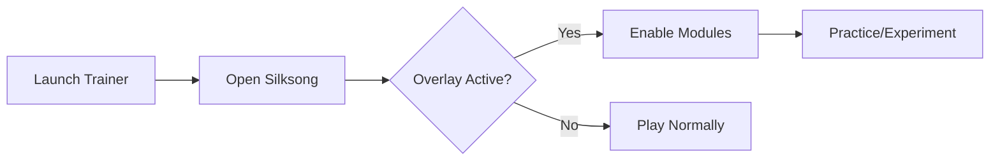

# Hollow Knight: Silksong Trainer 🎮

The **Hollow Knight: Silksong Trainer** is a pro-level software tool crafted for players who want to experiment, learn, and customize their gameplay. Whether you’re testing new strategies, practicing movement, or simply exploring Hallownest’s successor at your own pace, this trainer gives you full flexibility and power.

---

## 📝 Overview

This trainer isn’t about shortcuts—it’s about **control**. With adjustable parameters, overlays, and in-depth config files, you can fine-tune Hollow Knight: Silksong to match your preferences. Perfect for practicing boss fights, experimenting with charms, or analyzing map layouts.

\[!IMPORTANT]
Using a trainer can alter the intended challenge of the game. For best results, save your original progress separately before activating.

[](#)
[](#)
[](#)
[](#)


---

## ⚡ Features

* **Custom Health Scaling** – Adjust maximum HP to train survival skills.
* **Resource Controls** – Infinite Silk, adjustable Soul reserves, or focused regeneration.
* **Speed Modules** – Change Hornet’s movement speed for traversal practice.
* **Boss Tools** – Restart fights instantly, freeze frames, or reset arenas.
* **Visual Overlays** – Optional hitbox/range outlines for training precision.
* **Config Hotkeys** – Assign your own shortcuts for instant toggles.

---

## 🖥 Compatibility

| Platform       | Supported | Notes                   |
| -------------- | --------- | ----------------------- |
| Windows 10/11  | ✅         | Full native support     |
| Linux (Proton) | ⚠️        | Requires tweaks         |
| Steam Deck     | ⚠️        | Limited overlay support |
| macOS          | ❌         | Not supported currently |

\[!NOTE]
Accessibility: Hotkeys can be remapped to avoid conflicts with custom keyboards and controllers.

---

## 🔧 Setup Guide

1. **Download** the trainer package.
2. **Extract** the files into your Hollow Knight: Silksong directory.
3. Run the tool as **Administrator**.
4. Launch Silksong and press the chosen hotkey (default: `F1`).
5. Use the overlay menu to toggle features.

```bash
# Example launch command
SilksongTrainer.exe --overlay --config=custom.ini
```

---

## 🔄 Workflow Diagram



---

## ❓ FAQ

**Q: Can this damage my save file?**
A: Not directly, but altered values may cause progression issues. Back up saves before testing.

**Q: Does it work offline?**
A: Yes, the trainer is 100% offline once installed.

**Q: Are hotkeys customizable?**
A: Fully remappable via `config.ini`.

**Q: Will updates break compatibility?**
A: Minor patches are usually fine; major updates may require a trainer patch.

**Q: Can I use it for speedruns?**
A: Trainers are disallowed in official categories but useful for practicing movement and bosses.

---

## 🚀 Final Thoughts

The **Hollow Knight: Silksong Trainer** empowers players to train smarter, explore deeper, and understand the mechanics behind one of the most anticipated Metroidvanias. Whether for practice or analysis, it’s a versatile companion.

---
